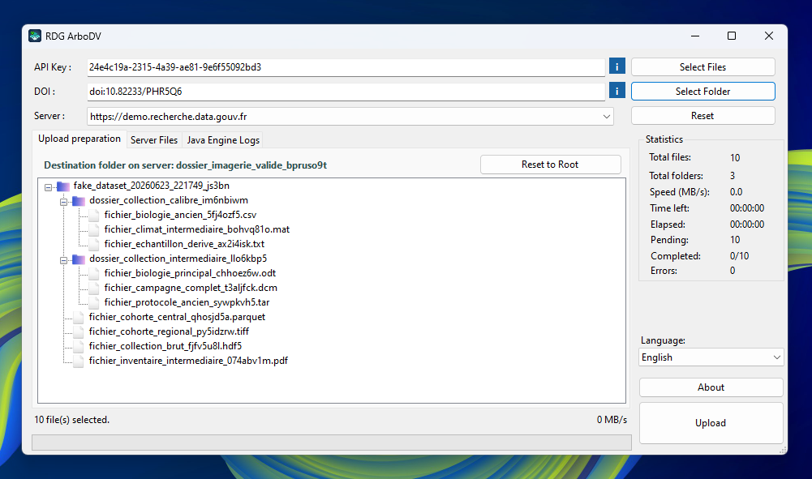
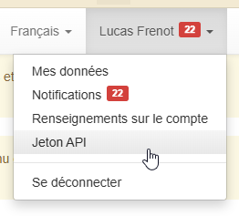
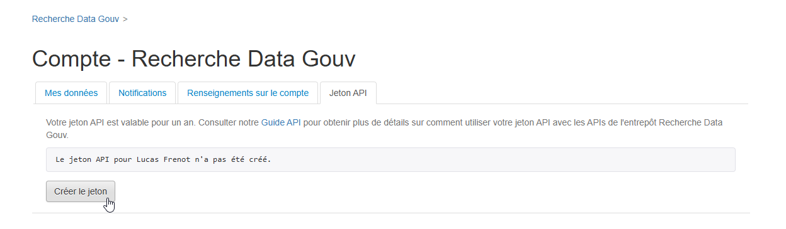
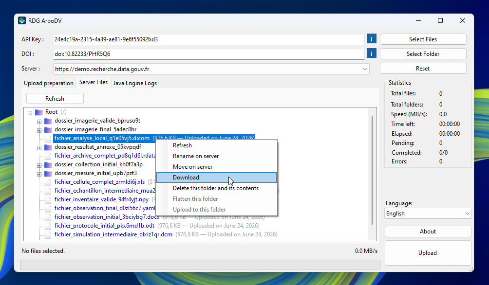
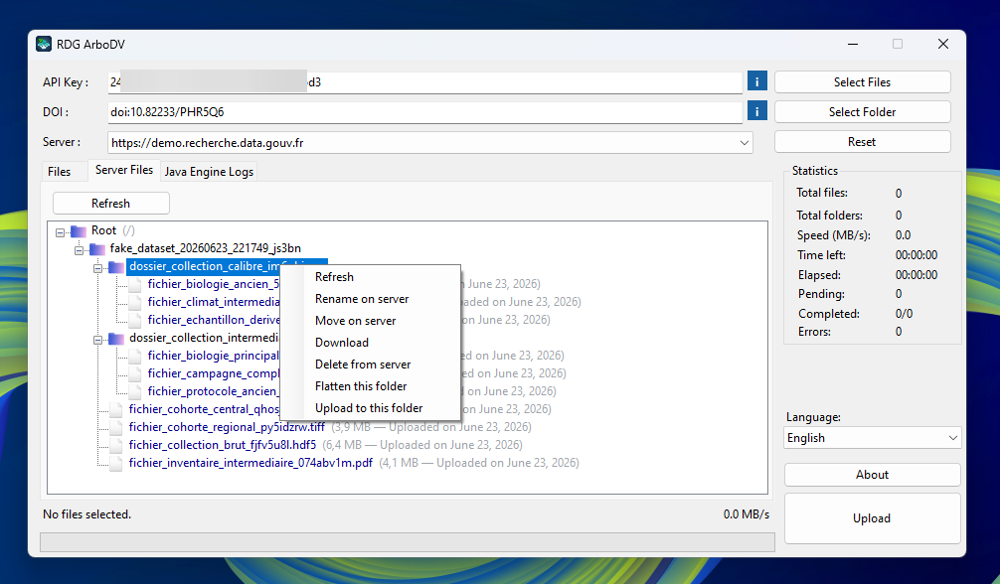

# RDG ArboDV

<p align="center">
  
</p>

<p align="center">
  <strong>Client bureautique Windows pour préparer, téléverser et administrer les fichiers d'un dataset Dataverse</strong><br>
  <sub>Conçu pour Recherche Data Gouv — Version 2.0.0</sub>
</p>

<p align="center">
  
  
  
  
  
</p>

## Sommaire

- [Présentation](#présentation)
- [Origine et évolution du projet](#origine-et-évolution-du-projet)
- [Fonctionnalités](#fonctionnalités)
- [Comprendre l'interface](#comprendre-linterface)
- [Prérequis](#prérequis)
- [Installation](#installation)
- [Utilisation](#utilisation)
- [Gestion des fichiers sur le serveur](#gestion-des-fichiers-sur-le-serveur)
- [Comprendre les couleurs et les états](#comprendre-les-couleurs-et-les-états)
- [Compilation et publication](#compilation-et-publication)
- [Architecture technique](#architecture-technique)
- [Dépannage](#dépannage)

---

## Présentation

### Origine et évolution du projet

RDG ArboDV a été initialement créé par **LFR54** dans le cadre de son stage de BTS. La première version a été imaginée, conçue et développée de A à Z par lui-même.

Les contraintes techniques liées à cette première architecture, notamment au mécanisme utilisé pour envoyer les données, ne permettaient toutefois pas d'atteindre le niveau de fiabilité attendu pour des dépôts volumineux. Ces limites empêchaient une mise en production responsable et ne permettaient donc pas à RDG ArboDV de remplacer DVUploader, ce qui constituait, en quelque sorte, l'objectif initial du projet.

L'idée est alors venue de reprendre [DVUploader, l'outil de téléversement de la communauté Dataverse](https://github.com/GlobalDataverseCommunityConsortium/dataverse-uploader), puis de le relier à l'interface graphique de RDG ArboDV.

Cette évolution a été réalisée après le stage, en dehors de tout contrat. N'ayant encore jamais développé en Java et l'intégration étant devenue particulièrement technique, LFR54 a choisi d'utiliser l'intelligence artificielle de manière consciente, assumée et transparente comme outil d'assistance au développement. Cette assistance a permis d'aborder plus sereinement la partie Java et les problématiques d'intégration avancées, sans retirer à LFR54 l'origine du projet, sa direction et la responsabilité de ses choix.

### À propos de RDG ArboDV

**RDG ArboDV** simplifie les dépôts volumineux dans un dataset Dataverse, notamment lorsqu'ils comportent de nombreux fichiers ou une arborescence complexe. L'application permet de préparer l'organisation du dépôt localement, de choisir précisément son emplacement sur le serveur, puis de suivre le transfert sans dépendre de l'interface web classique.

Elle est particulièrement adaptée aux équipes de recherche qui souhaitent :

- préparer un dépôt avant toute modification du serveur
- conserver ou réorganiser une arborescence de dossiers
- détecter les fichiers déjà présents
- téléverser de grands volumes avec un suivi détaillé
- administrer les fichiers distants depuis une interface graphique unique

> [!IMPORTANT]
> RDG ArboDV est destiné en priorité aux dépôts volumineux comportant de nombreux fichiers ou sous-dossiers. Pour un petit dépôt ponctuel, l'interface web Dataverse reste généralement plus adaptée et sollicite moins les ressources du serveur.

---

## Fonctionnalités

| Fonction | Description |
| --- | --- |
| **Préparation locale du dépôt** | Ajoute des fichiers et dossiers dans un espace de travail sans modifier immédiatement le serveur. |
| **Conservation de l'arborescence** | Reproduit dans Dataverse l'organisation visible dans l'espace de préparation. |
| **Réorganisation avant transfert** | Permet de déplacer, retirer ou aplatir les éléments de l'arbre local sans modifier les fichiers présents sur le disque. |
| **Choix graphique de la destination** | Dépose à la racine du dataset ou dans un dossier distant existant. |
| **Détection des doublons** | Distingue les fichiers déjà présents à la destination de ceux portant le même nom ailleurs dans le dataset. |
| **Téléversement de grands volumes** | Affiche la progression, la vitesse, le temps écoulé, le temps restant et les éventuelles erreurs. |
| **Gestion des fichiers distants** | Actualise, télécharge, déplace, renomme, aplatit ou supprime des fichiers et dossiers sur le serveur. |
| **Sélection multiple** | Autorise les opérations groupées sur plusieurs éléments locaux ou distants. |
| **Journal technique intégré** | Centralise les messages détaillés du moteur de téléversement afin de faciliter le diagnostic. |
| **Interface bilingue** | Détecte la langue du système au premier lancement et permet de basculer entre le français et l'anglais. |
| **Interface redimensionnable** | La fenêtre peut être agrandie ou maximisée et les arbres ainsi que les journaux utilisent automatiquement l'espace disponible. |
| **Gestion des interruptions** | Permet d'annuler une opération et interrompt proprement le transfert en cas de perte du réseau. |

---

## Comprendre l'interface

L'application est organisée autour de trois onglets complémentaires.

### Préparation du dépôt

Cet onglet constitue l'**espace de travail local**. Il contient uniquement les fichiers et dossiers qui seront pris en compte lors du prochain téléversement.

À ce stade, aucune donnée n'est encore envoyée au serveur. Vous pouvez donc :

- ajouter des fichiers isolés ou des dossiers complets
- vérifier l'arborescence qui sera créée dans Dataverse
- déplacer des éléments par glisser-déposer
- retirer des éléments du dépôt sans les supprimer du disque
- aplatir un ou plusieurs dossiers avant le transfert

L'organisation affichée dans cet onglet est la **source de vérité du dépôt** : elle détermine les chemins qui seront transmis au serveur.

### Fichiers sur le serveur

Cet onglet affiche le contenu réellement présent dans le dataset indiqué par le DOI. Il sert à la fois à consulter l'arborescence distante, à choisir le dossier de destination du prochain dépôt et à administrer les fichiers existants.

La sélection d'un dossier distant met immédiatement à jour la destination affichée dans l'onglet **Préparation du dépôt**. Si aucun dossier n'est sélectionné, la destination utilisée est la **racine (/)** du dataset.

### Logs du moteur Java

Cet onglet affiche le déroulement technique du transfert. Il n'est pas nécessaire de le consulter lors d'un usage normal, mais il fournit des informations utiles lorsqu'un fichier échoue, qu'une opération est interrompue ou qu'un diagnostic détaillé est nécessaire.

---

## Prérequis

### Système

- Windows 10 ou Windows 11
- runtime **.NET 8.0 Desktop**
- environnement Java **8 ou version ultérieure**, avec la commande `java` disponible dans le `PATH`
- accès réseau au serveur Dataverse ciblé

### Téléchargements officiels

Utilisez uniquement les sites officiels des éditeurs pour installer les composants requis :

- [.NET 8.0 — téléchargement officiel Microsoft](https://dotnet.microsoft.com/fr-fr/download/dotnet/8.0) — choisissez le **Desktop Runtime** (Exécution de bureau .NET) pour Windows
- [Eclipse Temurin — téléchargement officiel Adoptium](https://adoptium.net/temurin/releases/) — distribution OpenJDK gratuite et reconnue
- [Microsoft Build of OpenJDK — téléchargement officiel Microsoft](https://learn.microsoft.com/fr-fr/java/openjdk/download)
- [Oracle Java — téléchargement officiel Oracle](https://www.oracle.com/fr/java/technologies/downloads/)

Une seule distribution Java est nécessaire. Une version 64 bits récente est recommandée, avec Java 8 comme version minimale compatible.

### Informations nécessaires

- **Clé API** : jeton personnel autorisant l'application à agir sur votre compte Dataverse
- **DOI** : identifiant pérenne du dataset qui recevra les fichiers
- **Serveur** : instance Dataverse hébergeant le dataset

Les environnements proposés par défaut sont :

- production : `https://entrepot.recherche.data.gouv.fr`
- démonstration : `https://demo.recherche.data.gouv.fr`

Le DOI attendu suit le format `doi:10.xxxx/xxxxx`. Une URL complète telle que `https://doi.org/10.xxxx/xxxxx` peut également être collée : l'application la convertit automatiquement.

> [!CAUTION]
> La clé API donne accès à votre compte Dataverse. Ne la publiez jamais dans une capture d'écran, un ticket ou un dépôt Git. Si elle a été exposée, révoquez-la immédiatement depuis votre profil et générez-en une nouvelle.

---

## Installation

### Utiliser le binaire publié

1. Télécharger ou récupérer `RDG_Uploader_GUI.exe`
2. Vérifier que .NET 8 Desktop et Java sont installés
3. Lancer l'exécutable

Le moteur personnalisé `DVUploader-v1.3.0-RDGengine.jar` est intégré à l'exécutable et extrait automatiquement au démarrage. Il n'est donc pas nécessaire de copier manuellement le fichier JAR à côté de l'application.

### Utiliser le code source

1. Installer le SDK **.NET 8.0**
2. Ouvrir PowerShell ou une invite de commandes dans `rdg_arbodv_v2`
3. Compiler la solution :

   ```powershell
   dotnet build RDG_Uploader_GUI.sln
   ```

4. Lancer l'exécutable généré dans `bin/Debug/net8.0-windows/`

---

## Utilisation

### 1. Récupérer la clé API

Dans Recherche Data Gouv, ouvrez le menu de votre profil puis la page **Jeton API**.



Créez le jeton si nécessaire, puis copiez-le dans le champ **API Key** de RDG ArboDV.



### 2. Renseigner le dataset

Copiez le DOI affiché sur la page du dataset et collez-le dans le champ **DOI**.


Sélectionnez ensuite le serveur correspondant au dataset : production ou démonstration.

### 3. Choisir la destination

La destination par défaut est la **racine (/)** du dataset.

Pour téléverser dans un dossier existant :

1. ouvrez l'onglet **Fichiers sur le serveur**
2. sélectionnez le dossier souhaité
3. revenez dans **Préparation du dépôt**

Le chemin actif est rappelé dans l'en-tête **Dossier de destination sur le serveur**. Lorsqu'il est trop long pour être affiché entièrement, il est abrégé par des points de suspension ; placez le pointeur dessus pour consulter le chemin complet.

Utilisez **Déposer à la racine** pour annuler la destination sélectionnée et revenir à `/`.

### 4. Préparer les fichiers

Dans l'onglet **Préparation du dépôt** :

- **Sélectionner des fichiers** ajoute un ou plusieurs fichiers isolés
- **Sélectionner un dossier** ajoute son contenu et ses sous-dossiers
- le glisser-déposer permet d'ajouter ou de réorganiser les éléments
- le clic droit permet de retirer ou d'aplatir la sélection
- **Réinitialiser** vide entièrement l'espace de préparation sans effacer les fichiers du disque

Avant de continuer, vérifiez que l'arborescence affichée correspond à l'organisation attendue sur le serveur.

### 5. Vérifier les doublons

La comparaison avec le serveur est effectuée à partir du nom du fichier, de son chemin préparé et de la destination choisie. Consultez la [légende des couleurs](#comprendre-les-couleurs-et-les-états) avant de lancer le dépôt.

### 6. Lancer le téléversement

Cliquez sur **Téléverser**. Pendant l'opération :

- les champs et commandes susceptibles de modifier le dépôt sont temporairement désactivés
- la progression et les statistiques sont mises à jour
- le bouton **ANNULER** permet d'interrompre le transfert
- les détails restent disponibles dans **Logs du moteur Java**

Une fois l'opération terminée, l'arborescence distante est actualisée automatiquement.

---

## Gestion des fichiers sur le serveur

L'onglet **Fichiers sur le serveur** permet d'agir directement sur le contenu du dataset. Sélectionnez un ou plusieurs éléments, puis utilisez le clic droit.

<p align="center">
  
  
</p>

Les actions disponibles dépendent du type de sélection :

- **Actualiser** recharge l'état du dataset
- **Téléverser dans ce dossier** définit la destination du prochain dépôt
- **Télécharger** récupère localement un fichier ou une arborescence
- **Déplacer** choisit un autre dossier distant, avec possibilité d'en créer un
- **Renommer** modifie le nom d'un fichier
- **Aplatir** remonte le contenu du ou des dossiers sélectionnés d'un niveau
- **Supprimer** efface les fichiers correspondants après confirmation

> [!WARNING]
> Les actions de déplacement, renommage, aplatissement et suppression modifient réellement le dataset distant. Vérifiez toujours le DOI, le serveur et la sélection avant de confirmer.

---

## Comprendre les couleurs et les états

Dans l'onglet **Préparation du dépôt** :

| Affichage | Signification |
| --- | --- |
| **Texte normal** | Le fichier n'a pas été trouvé sur le serveur à partir des informations actuellement chargées. |
| **Vert — Déjà sur le serveur** | Le fichier existe exactement au chemin de destination prévu. Il ne sera pas téléversé une seconde fois. |
| **Orange — Existe déjà dans…** | Un fichier portant le même nom existe dans un autre dossier du dataset. Le chemin existant est indiqué afin de vous permettre de décider si le nouveau dépôt est volontaire. |
| **Orange — En cours** | Le fichier est en cours de traitement par le moteur de téléversement. |
| **Vert — Terminé** | Le fichier a été traité avec succès. |
| **Rouge — Erreur** | Le fichier n'a pas pu être traité ; consultez le journal technique. |

Lorsque le serveur finalise ou indexe une série de fichiers, le message **Serveur temporairement occupé : finalisation en cours, aucune action requise** peut apparaître. Cet état est normal et temporaire : l'application attend automatiquement que le serveur soit de nouveau disponible.

---

## Compilation et publication

Le projet principal cible **.NET 8.0 pour Windows**.

### Compilation Debug

```powershell
dotnet build RDG_Uploader_GUI.sln
```

### Compilation Release

```powershell
dotnet build -c Release RDG_Uploader_GUI.sln
```

### Publication en fichier unique

Depuis le dossier `rdg_arbodv_v2` :

```powershell
dotnet publish -c Release -r win-x64 --self-contained false -p:PublishSingleFile=true -p:PublishReadyToRun=true RDG_Uploader_GUI.csproj
```

Le résultat est généré dans :

```text
bin/Release/net8.0-windows/win-x64/publish/
```

La publication utilise `--self-contained false` : le runtime .NET 8 Desktop doit donc être installé sur le poste cible.

---

## Architecture technique

RDG ArboDV repose sur deux composants :

1. **Interface C# WinForms** — gestion de l'espace de préparation, appels à l'API Dataverse, arborescences, statistiques et opérations distantes
2. **Moteur Java DVUploader personnalisé** — transfert effectif des fichiers vers Dataverse

Lors du téléversement, l'interface construit un manifeste JSON temporaire. Chaque entrée associe le chemin réel du fichier local à son dossier virtuel de destination. Cette approche permet de réorganiser ou d'aplatir visuellement un dépôt sans déplacer ni dupliquer les fichiers sur le disque.

Le JAR personnalisé est embarqué comme ressource dans l'application. Il est extrait dans le dossier de l'exécutable ou, si celui-ci n'est pas accessible en écriture, dans le profil local de l'utilisateur.

---

## Dépannage

### Les fichiers du serveur ne s'affichent pas

- vérifiez la clé API
- vérifiez que le DOI correspond au serveur sélectionné
- ouvrez **Fichiers sur le serveur** puis cliquez sur **Actualiser**
- contrôlez votre connexion réseau

### Java n'est pas reconnu

Installez Java 8 ou une version plus récente, puis vérifiez dans PowerShell :

```powershell
java -version
```

Si la commande n'est pas reconnue, ajoutez le dossier `bin` de Java à la variable d'environnement `PATH`.

### Un fichier apparaît en orange

Le nom existe déjà ailleurs dans le dataset. Lisez le chemin indiqué, puis vérifiez si vous souhaitez réellement créer une seconde occurrence dans la destination actuellement choisie.

### Le serveur est temporairement occupé

Dataverse peut verrouiller brièvement un dataset pendant son indexation. Laissez l'application ouverte : elle reprend automatiquement dès que le serveur libère l'opération.

### Une opération échoue

Consultez **Logs du moteur Java** et les compteurs d'erreurs. En cas d'interruption réseau, actualisez ensuite l'arborescence distante avant de relancer le dépôt afin de vérifier quels fichiers ont déjà été reçus.

---

<p align="center">
  <sub>RDG ArboDV — Préparation, téléversement et gestion de datasets Dataverse</sub>
</p>
