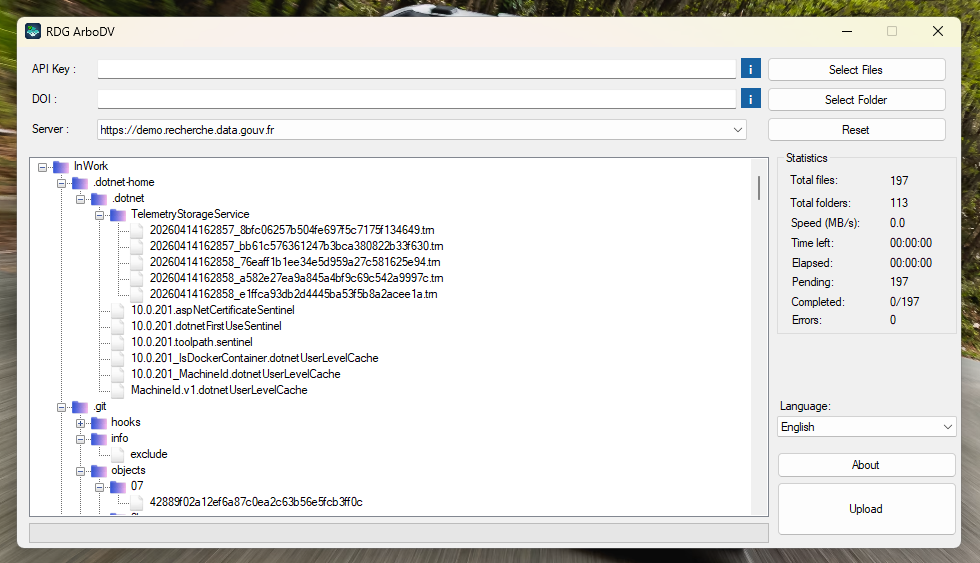
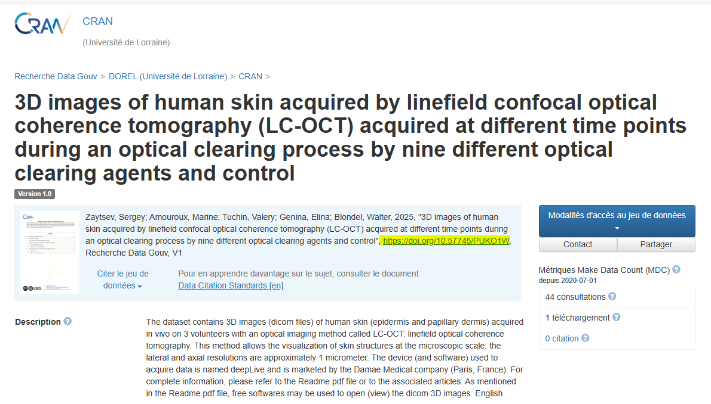

# RDG ArboDV

  

  <strong>Client bureautique Windows pour l'ajout de fichiers dans un dataset Dataverse</strong> 
  Version 1.2.0

  <a href="#fonctionnalites">Fonctionnalités</a> •
  <a href="#apercu">Aperçu</a> •
  <a href="#installation">Installation</a> •
  <a href="#utilisation">Utilisation</a> •
  <a href="#parametres-requis">Paramètres requis</a> •
  <a href="#build">Build</a>

  
  
  
  
  

---

## Aperçu

**RDG ArboDV** est un logiciel de bureau conçu pour simplifier le dépôt de fichiers dans un dataset Dataverse (`https://recherche.data.gouv.fr`), en particulier lorsque le volume est important ou que l'arborescence à conserver est complexe.

L'application s'adresse aux équipes qui doivent préparer un versement propre, de façon maîtrisé et fiable, sans dépendre de l'interface web pour chaque opération.

> [!WARNING]
> Ce logiciel est destiné en priorité aux dépôts volumineux comportant de nombreux sous-dossiers.  
> Pour de petits jeux de données, il est recommandé d'utiliser l'interface web afin de limiter la charge sur les serveurs.

## Fonctionnalités

| Fonction | Bénéfice |
| --- | --- |
| Upload de fichiers et de dossiers | Prépare rapidement un lot de dépôt depuis un poste Windows |
| Conservation de l'arborescence | Respecte l'organisation logique des données dans le dataset |
| Aplatissement ciblé d'un dossier | Réorganise un lot avant envoi sans reprendre toute la sélection |
| Gestion des reprises sur erreur | Retente automatiquement l'envoi en cas d'échec ponctuel |
| Suivi visuel de progression | Permet de suivre l'état global et fichier par fichier |
| Statistiques intégrées | Affiche volume, vitesse, temps écoulé et temps restant |

## Paramètres requis

Le logiciel repose sur trois informations simples :

- **API Key** : la clé personnelle qui autorise le dépôt sans utiliser le mot de passe du compte.
- **DOI** : l'identifiant pérenne du dataset cible.
- **Serveur** : l'instance Dataverse sur laquelle les fichiers doivent être envoyés.

Le logiciel peut être utilise avec les deux environnements proposes dans l'interface :

- **Entrepot public** : `https://entrepot.recherche.data.gouv.fr`
- **Instance de demo** : `https://demo.recherche.data.gouv.fr`

Le DOI attendu par l'application suit le format `doi:10.xxxx/xxxxx`.  
Si l'utilisateur colle une URL complète de type `https://doi.org/...`, le logiciel la normalise automatiquement dans le bon format.

## Installation

### Utilisation du binaire

- Utiliser un poste Windows.
- Disposer de l'environnement `.NET Framework 4.8`.
- Lancer l'exécutable du logiciel.

### Utilisation depuis le code source

- Ouvrir la solution `RDG_Uploader_GUI.sln`.
- Restaurer les dépendances NuGet si nécessaire.
- Compiler le projet `RDG_Uploader_GUI` en `Debug` ou `Release`.

## Utilisation

## 🔧 Préparation à son utilisation

1. Veuillez créer ou récupérer votre jeton API existant. Pour ce faire :
   Cliquez en haut à droite sur votre profil, puis sur **Jeton API**.

   

   Cliquez sur "**Créer le jeton**", puis copiez-le pour le coller dans RDG ArboDV.

   

   Vous verrez le DOI (surligné en jaune) : c’est l’URL d’accès à votre jeu de données.

2. Indiquer le DOI du dataset cible.
    

    Cela cette URL à ajouter dans le logiciel.

3. Choisir le serveur.
4. Ajouter des fichiers ou un dossier complet.
5. Vérifier la structure dans l'arborescence.
6. Lancer l'upload.

## Positionnement

RDG ArboDV a été pensé pour un usage **opérationnel et robuste** :

- Avec une interface bureau simple, sans surcharge de fonctionnalité inutile ;
- Prise en main rapide pour les utilisateurs non techniques ;
- Ddapté aux dépôts volumineux ;
- Suivi clair pendant toute la durée du transfert.

## Cas d'usage recommandés

- Dépôt d'un grand nombre de fichiers dans un dataset existant.
- Envoi de jeux de données organisés en sous-dossiers.
- Préparation d'un versement nécessitant un meilleur contrôle que l'interface web classique.
- Opérations de dépôt répétées sur une même infrastructure Dataverse.

## Environnement technique

| Élément | Valeur |
| --- | --- |
| Type d'application | Windows Forms |
| Langage principal | C# |
| Framework cible | .NET Framework 4.8 |
| Format de diffusion | Application Windows |

## Build

Le projet peut être compilé depuis Visual Studio avec une configuration classique `.NET Framework 4.8`.

Étapes recommandées :

1. Ouvrir `RDG_Uploader_GUI.sln`.
2. Vérifier la restauration des packages NuGet.
3. Sélectionner la configuration `Release`.
4. Compiler la solution.

---

  RDG ArboDV • Présentation logicielle • Version 1.2.0 • Par Lucas FRENOT

